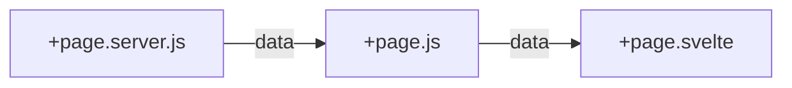

# SvelteKit For Beginners | Movie App Tutorial

[YouTube: SvelteKit For Beginners | Movie App Tutorial](https://www.youtube.com/watch?v=ydR_M0fw9Xc)

[YouTube Channel: Dev Ed](https://www.youtube.com/c/DevEd)

[SvelteKit](https://kit.svelte.dev/)

## Svelte/Kit Documentation

[The migration for the infamous SvelteKit breaking changes everyone asks me about](https://github.com/jmagrippis/techy-cat/pull/15)

[Loading data • Docs • SvelteKit](https://kit.svelte.dev/docs/load)

"The `data` for `+page.svelte` comes from `+page.js`, which in turn receives `data` from `+page.server.js`"



`+page.server.js`

```javascript
/** @type {import('./$types').PageServerLoad} */
export function load() {
  return {
    a: 1
  };
}
```

`+page.js`

```javascript
/** @type {import('./$types').PageLoad} */
export function load({ data }) {
    return {
      a: data.a, 
      b: data.a * 2
    };
}
```

`+page.svelte`

```html
<script lang="ts">
    /** @type {import('./$types').PageData} */  
    export let data: any;
    
    console.log(`a: ${data.a}`); // `undefined`, it wasn't passed through in +page.js
    console.log(`b: ${data.b}`); // `2`
</script>
```

### Routing

[+page | Routing • Docs • SvelteKit](https://kit.svelte.dev/docs/routing#page)

### Logic / Each blocks

[Tutorial: Logic / Each blocks](https://svelte.dev/tutorial/each-blocks)

## APIs

[TMDB: The Movie Database](https://www.themoviedb.org)

[TMDB: API Overview](https://www.themoviedb.org/documentation/api)

[TMDB: API Documentation](https://developers.themoviedb.org/3/getting-started/introduction)

[TMDB: API Documentation > Popularity](https://developers.themoviedb.org/3/getting-started/popularity)

[TMDB: API Documentation > Movies > Get Popular](https://developers.themoviedb.org/3/movies/get-popular-movies)

`https://api.themoviedb.org/3/movie/popular?api_key=<<api_key>>&language=en-US&page=1`

## Global References

### IDE: VS Code

[Svelte for VS Code](https://marketplace.visualstudio.com/items?itemName=svelte.svelte-vscode)

`settings.json`

```json
"[svelte]": {
     "editor.defaultFormatter": "svelte.svelte-vscode"
},
```

### TypeScript

[Binding element 'index' implicitly has an 'any' type](https://stackoverflow.com/questions/40745992/binding-element-index-implicitly-has-an-any-type)

Error Message:

`Binding element 'fetch' implicitly has an 'any' type.`

Solution:

```js
export async function load({ fetch } : { fetch:any }) {
    // pass
}
```

#### Error Handling

[Typescript error "Cannot write file ... because it would overwrite input file."](https://stackoverflow.com/questions/42609768/typescript-error-cannot-write-file-because-it-would-overwrite-input-file)

### JavaScript Promise, Async, Await

[Promise.resolve() | MDN Web Docs](https://developer.mozilla.org/en-US/docs/Web/JavaScript/Reference/Global_Objects/Promise/resolve)

[How to access the value of a promise?](https://stackoverflow.com/questions/29516390/how-to-access-the-value-of-a-promise/73445474#73445474)

```js
let promiseB = promiseA;

promiseB.then((value) => {
    console.log(value);
});
```

Multi-level JSON object:

```js
let promiseB = promiseA;

promiseB.then((value) => {
    console.log(value?.key1.key2);
});
```

[Use await block in Svelte 3](https://svelte.dev/repl/34c69d290e43451ea2427f7f66e3e59d?version=3.12.1)

```html
{#await fetchMovieData()}
    <p>...waiting</p>
{:then data}
    <h1>{ current_time }</h1>
    <p>{JSON.stringify(data?.props.popular[0].original_title)}</p>
{:catch error}
    <p>An error occurred!</p>
{/await}
```

[Managing fetch promises with actions](https://svelte.dev/repl/5c95e18702764aefa71ff2b4616a6c6e?version=3.20.1)

### JSON

[{JSON} Placeholder: Free fake API for testing and prototyping.](https://jsonplaceholder.typicode.com/)

### HTML & CSS

[HTML Tables | W3 Schools](https://www.w3schools.com/html/html_tables.asp)

### Markdown: Diagrams

[Include diagrams in your Markdown files with Mermaid](https://github.blog/2022-02-14-include-diagrams-markdown-files-mermaid/)

[mermaid: Generation of diagram and flowchart from text in a similar manner as markdown](https://mermaid-js.github.io/mermaid/#/)

## Tutorials

[Lets build SvelteKit App || Pokemon App](https://tkssharma.com/sveltejs-with-sveltekit-application-pokemon-app/)

[SvelteKit Crash Course Tutorial #8 - Loading Data & SSR](https://www.youtube.com/watch?v=a5OiuEu1Q6M)

[Magically load data with SvelteKit Endpoints](https://www.youtube.com/watch?v=f6prqYlbTE4)

[GitHub: Techy Cat](https://github.com/jmagrippis/techy-cat)
